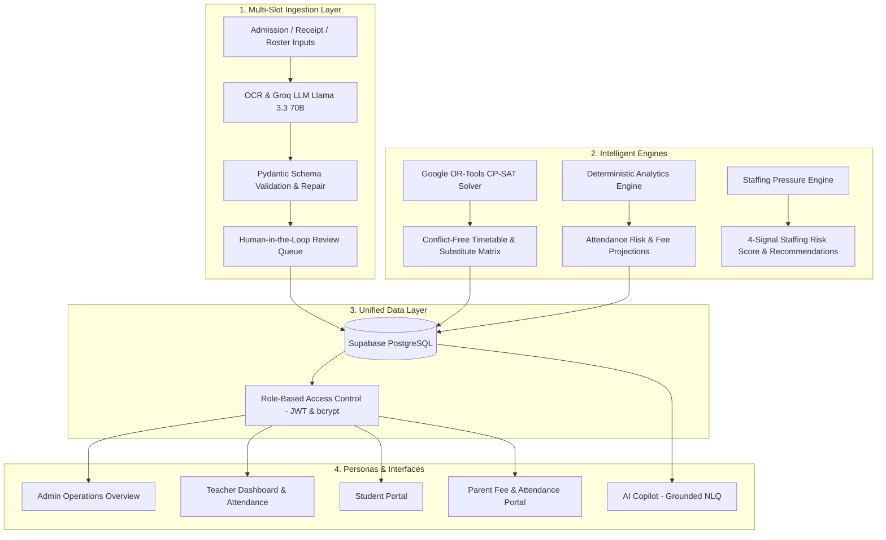

# EduOS AI — Autonomous School Operating System
> **Transforming fragmented school operations into an intelligent, proactive operating system with Groq AI, Google OR-Tools, and Supabase.**

[](https://eduos-ai-9ccfhasj4dkbznvatlpc7a.streamlit.app/)
[](https://www.python.org/)
[](https://streamlit.io/)
[](https://supabase.com/)
[](https://groq.com/)
[](https://developers.google.com/optimization)

> 🚀 **Live Demo:** [https://eduos-ai-9ccfhasj4dkbznvatlpc7a.streamlit.app/](https://eduos-ai-9ccfhasj4dkbznvatlpc7a.streamlit.app/)  
> **Demo Login:** Username: `dev_admin` | Password: `password123`

---

## 🎬 Demo Video

[](https://www.youtube.com/watch?v=CYIu5YFX_zM)

> Click the thumbnail above to watch the full demo walkthrough.

---

## 1. Problem Statement

Modern educational institutions rely on disconnected administrative systems and manual workflows:
- **Manual Paperwork & Data Entry:** Physical admission forms, fee receipts, and leaves require tedious manual digitization prone to human error.
- **Timetable Clashes & Staffing Churn:** Sudden teacher absences cause scheduling chaos that manual spreadsheets cannot resolve in real time.
- **Siloed Databases:** Student attendance, fee ledgers, academic records, and schedules reside in disconnected databases with no unified view.
- **Reactive Management:** Administration only notices student drop-out risks, fee defaults, or staffing shortages after problems escalate.

---

## 2. Solution Overview

**EduOS AI** unifies administrative, academic, and scheduling workflows into a single intelligent operating system:
1. **Automates Ingestion:** Extracts structured data from raw forms, PDFs, and roster notes via Groq OCR & LLM pipelines with Pydantic validation.
2. **Eliminates Conflicts:** Formulates master schedules and real-time substitute reassignments as a mathematical constraint satisfaction problem solved by Google OR-Tools CP-SAT.
3. **Connects Data:** Unifies Student, Teacher, Attendance, Fee, and Schedule data in Supabase with Role-Based Access Control (RBAC).
4. **Delivers Grounded Intelligence:** Provides natural-language querying (AI Copilot) and deterministic risk metrics for staffing and attendance.

---

## 3. System Architecture & Workflow



---

## 4. Key Implemented Features

### 📄 1. AI Document Reader (Multi-Slot Intake)
- **Multi-Slot Inputs:** Accepts admission forms and fee receipts via picture upload, document file (PDF/CSV/TXT), or raw pasted text.
- **Schema-Constrained LLM Extraction:** Extracts strict JSON using Groq AI (`llama-3.3-70b-versatile`).
- **Validation & Audit Trail:** Validates all extracted fields through Pydantic models with automated JSON repair.
- **Human-in-the-Loop Commit:** Provides an administrative review queue before committing student records to Supabase.

### 👩‍🏫 2. Teacher Availability & Roster Parser
- Digitizes unstructured teacher roster text and availability constraints.
- Tracks faculty directory, assigned classes, and custom unavailability rules (e.g., leave days, unavailable periods).

### 🗓️ 3. Smart Timetable Engine (Google OR-Tools CP-SAT)
- Solves class scheduling with hard constraints (no double-booking of teachers, rooms, or class sections).
- **One-Click Substitute Assignment:** When a teacher is toggled absent, the CP-SAT constraint solver reassigns available faculty without disrupting unaffected slots.

### 📈 4. Predictive Insights & Analytics
- Deterministic analysis computed directly over live school data.
- Identifies students below the 75% attendance threshold, tracks fee overdue patterns, and projects risk levels.

### 📊 5. Smart Staffing Risk Score & Recommendations
- Calculates a 0–100 staffing pressure score across 4 weighted operational signals:
  - **Signal A (35%):** Teacher unavailability ratio.
  - **Signal B (30%):** Uncovered timetable slot ratio.
  - **Signal C (20%):** Teacher overload ratio.
  - **Signal D (15%):** Substitute dependency ratio.
- Generates actionable workload and hiring recommendations for school administrators.

### 🤖 6. Grounded AI Copilot (Natural-Language Query)
- Natural-language query interface over live institutional data.
- Numerical facts and metrics are retrieved directly from the Analytics and Staffing engines, preventing LLM hallucinations.
- Features automatic intent classification and deterministic offline fallback.

### 🚨 7. Proactive Alerts Center
- Real-time rule-based monitoring for critical attendance drops, timetable clashes, unpaid fees, and staffing shortages.
- Scopes alerts to relevant user roles.

### 🗄️ 8. Unified Data Layer
- Central source of truth joining Student ID $\leftrightarrow$ Attendance $\leftrightarrow$ Fee Ledger $\leftrightarrow$ Master Timetable.

### 👥 9. Four Tailored User Personas
- **Admin:** Complete institutional oversight, document intake, timetable solver, analytics, and copilot.
- **Teacher:** Quick class attendance marking (present/absent) with instant Supabase updates and faculty timetable.
- **Student:** Personal timetable view, academic GPA, attendance progress, and fee ledger status.
- **Parent:** Child monitoring portal, attendance threshold tracking, and simulated fee payment.

---

## 5. Technology Stack

| Layer | Technology | Purpose |
| :--- | :--- | :--- |
| **Frontend & UI** | **Streamlit (1.30+)** | Interactive multi-persona responsive web application |
| **Design System** | **Vanilla CSS + Inter Typography** | Custom enterprise design system with light cards and status badges |
| **Database** | **Supabase (PostgreSQL)** | Persistent cloud storage for students, faculty, schedules, and alerts |
| **LLM Engine** | **Groq (`llama-3.3-70b-versatile`)** | High-throughput structured document extraction and natural-language query |
| **Optimization Solver** | **Google OR-Tools (CP-SAT)** | Constraint satisfaction solver for master timetables and substitution logic |
| **Data Validation** | **Pydantic (v2)** | Strict schema validation, sanitization, and JSON parsing |
| **Authentication** | **PyJWT & bcrypt** | Cryptographic password hashing and Role-Based Access Control (RBAC) |
| **Data Analysis** | **Pandas & NumPy** | In-memory data manipulation, metrics calculation, and dataframe rendering |

---

## 6. Repository Structure

```text
EduOS-AI/
├── .env.example              # Template for environment configuration
├── requirements.txt          # Python dependencies
├── schema.sql                # Supabase PostgreSQL database schema & RLS policies
├── seed_dev_users.py         # Development user account seed script
├── verify_supabase.py        # Database connectivity & schema smoke test script
├── app.py                    # Main Streamlit application entry point & router
├── ui_components.py          # Unified design system, CSS injection, and UI cards
├── auth.py                   # JWT issuance, bcrypt hashing, and RBAC permissions
├── data_store.py             # Session state store, sync helpers, and action handlers
├── db_client.py              # Supabase database client interface (CRUD operations)
├── env_config.py             # Environment variable validation & diagnostic utilities
├── groq_client.py            # Groq API client with JSON extraction and fallback
├── doc_parser.py             # Admission form OCR and structured parsing pipeline
├── teacher_parser.py         # Faculty roster and availability constraint parser
├── timetable_parser.py       # Timetable schedule extraction pipeline
├── timetable_solver.py       # Google OR-Tools CP-SAT timetable optimization solver
├── analytics_engine.py       # Deterministic analytics, attendance risk & fee forecasts
├── staffing_engine.py        # Staffing pressure score formula and recommendations
├── copilot_engine.py         # Grounded AI Copilot NLQ engine and intent classifier
├── validation.py             # Pydantic schemas, validation models, and JSON repair
└── tests/                    # Automated test suite
    ├── test_analytics_engine.py
    ├── test_copilot_engine.py
    ├── test_groq_integration.py
    └── test_staffing_engine.py
```

---

## 7. Getting Started

### Prerequisites
- Python 3.10, 3.11, 3.12, or 3.13
- A [Supabase](https://supabase.com/) project (PostgreSQL database)
- A [Groq](https://console.groq.com/) API Key *(optional, deterministic fallbacks available)*

### Step 1: Clone and Set Up Virtual Environment

```bash
git clone https://github.com/Rani2025-tech/EduOS-AI.git
cd EduOS-AI

# Create virtual environment
python -m venv venv

# Activate virtual environment
# Windows (PowerShell):
.\venv\Scripts\Activate.ps1
# macOS / Linux:
source venv/bin/activate

# Install dependencies
pip install -r requirements.txt
```

### Step 2: Configure Environment Variables

Copy `.env.example` to `.env`:

```bash
cp .env.example .env
```

Fill in your configuration in `.env`:

```ini
# Supabase Project Configuration
SUPABASE_URL=https://your-project-id.supabase.co
SUPABASE_KEY=your-supabase-anon-key

# Groq LLM API Key
GROQ_API_KEY=gsk_your_groq_api_key

# JWT Secret Key (generate using: python -c "import secrets; print(secrets.token_hex(32))")
JWT_SECRET_KEY=your_generated_32_byte_hex_secret
```

### Step 3: Initialize Database Schema

1. Open your **Supabase Dashboard &rarr; SQL Editor**.
2. Copy the entire contents of [`schema.sql`](schema.sql), paste into the editor, and click **Run**.

### Step 4: Seed Development Users

Seed default test accounts into your database:

```bash
# Windows PowerShell:
$env:DEV_SEED_PASSWORD="password123"; python seed_dev_users.py

# macOS / Linux:
DEV_SEED_PASSWORD="password123" python seed_dev_users.py
```

### Step 5: Verify Connectivity

Run the diagnostic smoke test:

```bash
python verify_supabase.py
```

---

## 8. Running the Application

Launch the Streamlit web application:

```bash
streamlit run app.py
```

Open `http://localhost:8501` in your browser.

### Test Credentials

| Role | Username | Default Password |
| :--- | :--- | :--- |
| **Admin** | `dev_admin` | `password123` *(or your set `DEV_SEED_PASSWORD`)* |
| **Teacher** | `dev_teacher` | `password123` |
| **Student** | `dev_student` | `password123` |
| **Parent** | `dev_parent` | `password123` |

---

## 9. Automated Testing

Run the test suite with `pytest`:

```bash
python -m pytest tests/test_analytics_engine.py tests/test_copilot_engine.py tests/test_staffing_engine.py
```

To run all integration tests (including Groq live tests if API key is configured):

```bash
python -m pytest
```

---

## 10. Security & Safety

- **Zero-Secret Commitment:** Never commit `.env` or API keys to version control (`.gitignore` excludes all credential files).
- **Password Security:** Passwords are never stored in plaintext; all credentials use `bcrypt` password hashing with random salt.
- **Role-Based Access Control:** All cross-domain record access is scoped in `auth.py` by role (`admin`, `teacher`, `student`, `parent`).
- **Input Sanitization:** Multi-slot inputs are validated and sanitized through Pydantic schemas before writing to the database.

---

## 11. Project Status & Roadmap

### ✅ Implemented Prototype Features
- [x] Multi-slot document processing pipeline with Groq AI extraction.
- [x] Human-in-the-loop document audit and review queue.
- [x] Google OR-Tools CP-SAT constraint-based timetable scheduler and substitute solver.
- [x] Real-time faculty absence toggle and automatic substitution matrix.
- [x] 4-signal deterministic staffing pressure score and recommendation engine.
- [x] Grounded natural-language query AI Copilot with offline fallback.
- [x] Role-based authentication (Admin, Teacher, Student, Parent) with JWT and bcrypt.
- [x] Live attendance marking and simulated fee ledger updates in Supabase.
- [x] Comprehensive test suite with 112+ unit tests.

### 🔮 Future Roadmap (Post-Hackathon)
- [ ] Direct WhatsApp / SMS webhook notifications for parent alerts.
- [ ] Mobile application built with React Native.
- [ ] Multi-tenant school district support with partitioned organizational schemas.
- [ ] Biometric hardware integration for physical attendance kiosk synchronization.

---

## 12. License

This project is licensed under the MIT License — see the [LICENSE](LICENSE) file for details.